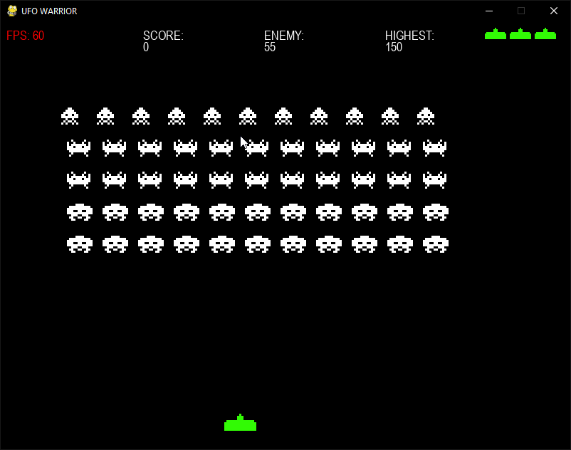

# UFO-WARRIOR
Игрок управляет движением и стрельбой космического корабля с помощью мыши. Если все враги будут уничтожены до того, как враг достигнет нижней части игрового интерфейса, игра будет выиграна, иначе игра завершится неудачей.

# Основные классы игры являются (находятся в Utils.py):
•	Класс аircraftSprite() - Летающий корабль. Наш космический корабль управляется с помощью мыши, и он должен иметь возможность стрелять, двигаться и взрываться после удара врага.

•	Класс enemySprite() – Класс нашего врага. Враг автоматически управляется компьютером, и он должен иметь возможность стрелять, двигаться и взрываться после удара с нашей стороны.

•	Класс ufoSprite() – НЛО. НЛО управляется компьютером и может рассматриваться как пасхальное яйцо. Если вы ударите это пасхальное яйцо, вы получите много бонусных очков. Когда бонусные очки накопятся до определенной суммы, вы получите дополнительное здоровье. НЛО нужно только иметь возможность двигаться и взрываться после удара с нашей стороны.

•	Класс myBulletSprite() – Пули Летающего корабля 
Класс enemyBulletSprite() – Пули наших врагов
И наш космический корабль, и противник должны стрелять пулями, и они должны иметь возможность непрерывно двигаться вперед.

# Game Display

